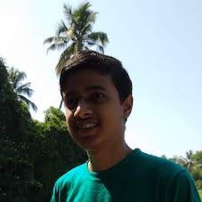

+++
title = "About"
description = "About Pranav Shridhar"
type = "about"
date = 2019-12-18
+++

Hey there! I am **Pranav Shridhar**, a sophomore CS student in Govt. Model Engineering College. I'm a passionate coder, chess player, blogger and a technical speaker. I like to stay in tune with the latest technologies through continued learning and development. I aspire to become a Fullstack Software Engineer. I code mostly Python and JavaScript and my main development stack is Django, React and PostgreSQL/MongoDB.

I love to play chess both [online](https://lichess.org/@/pranavmodx) and on [board](http://ratings.fide.com/profile/45034958). It rejuvenates my mind and improves my focus and concentration. Challenge me anytime for a game! ;)

I also like reading books - crime, detective, mystery and science fiction; and non fiction for self improvement. Some of my favourite authors are HG Wells, Dan Brown and Dale Carnegie.

Besides these, I enjoy listening to music. I shuffle between calm and soothing music and energetic pop and psychedelic rock music. Some of my favourite bands are Linkin Park, Pink Floyd, Tame Impala, Weeknd and White Moth Black Butterfly!

Through this blog, I aim to share all my experiences, learnings and art to all of you people. If you would like to know more about me or anything else, feel free to contact me via my website, mail or social media.

Happy reading! :)

